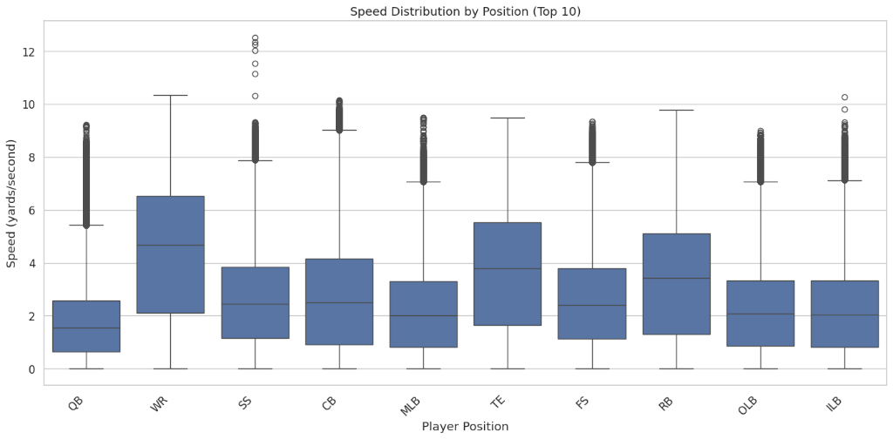
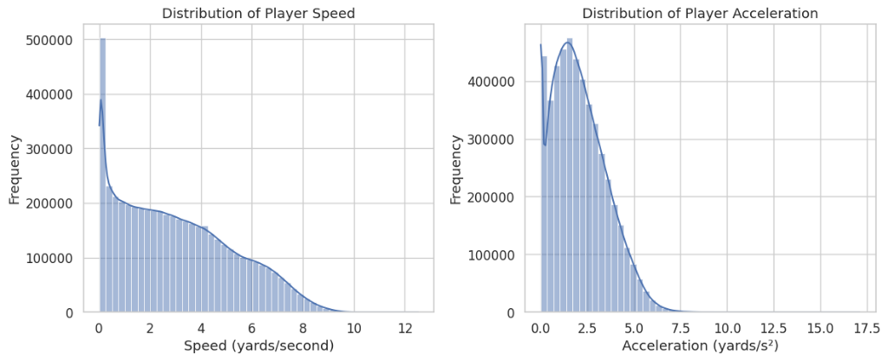
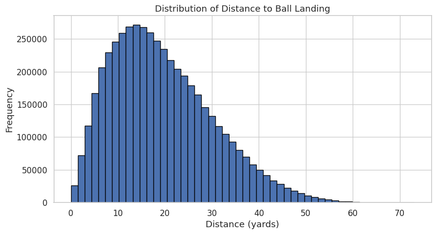
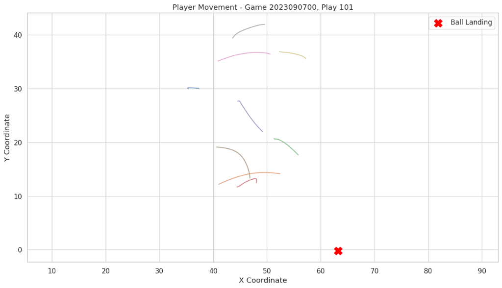
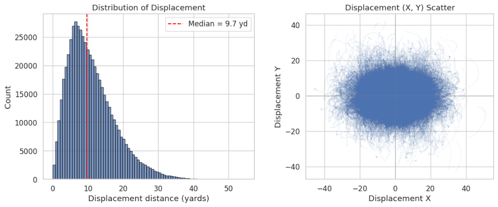

# NFL Big Data Bowl 2026 – Analytics Track

## Overview

This project explores player-tracking data from the **NFL Big Data Bowl 2026 – Analytics competition**. The goal is to understand player behavior and game dynamics through **exploratory data analysis (EDA)** rather than predictive modeling.

The analysis combines 18 weeks of input and output files into a single dataset to study player movement, speed distributions, and positional relationships. Using **Python (Pandas, NumPy, Matplotlib, Seaborn)**, the notebook investigates how attributes such as **speed, acceleration, and distance to the ball** relate to play outcomes.

---

## Dataset Summary

| Metric | Value |
|--------|-------|
| **Total Rows** | 4,880,579 |
| **Rows with Future Position** | 560,426 |
| **Columns** | 25 |
| **Weeks** | 18 |
| **Supplementary Data** | 18,009 plays, 41 columns |

### Key Statistics

| Feature | Mean | Std | Min | Max |
|---------|------|-----|-----|-----|
| Speed (yards/s) | 3.04 | 2.23 | 0.00 | 12.53 |
| Acceleration (yards/s²) | 2.13 | 1.43 | 0.00 | 17.12 |
| Distance to Ball Landing | 19.42 | 10.76 | 0.01 | 73.08 |
| Displacement Distance | 11.01 | 6.65 | 0.01 | 54.64 |

---

## Players to Predict

The competition focuses on predicting future positions for specific players. Here's the breakdown:

**Total rows:** 1,303,440

### By Position
| Position | Count |
|----------|-------|
| CB | 371,504 |
| WR | 238,910 |
| FS | 149,236 |
| SS | 121,294 |
| ILB | 104,299 |
| TE | 91,654 |

### By Role
| Role | Count |
|------|-------|
| Defensive Coverage | 906,526 |
| Targeted Receiver | 396,914 |

---

## Key Findings

### 1. Movement Patterns
- **Wide Receivers (WR)** reached the highest speeds (median ~4.8 yards/s) with the widest range of movement
- **Cornerbacks (CB)** show similar speed patterns due to man-to-man coverage
- **Linebackers** and **Defensive Ends** maintain lower, tighter speed ranges

### 2. Displacement Analysis
- **Median displacement**: 9.7 yards
- **90th percentile**: 20.14 yards
- **95th percentile**: 23.85 yards
- **99th percentile**: 31.04 yards

### 3. Spatial Context
- Most players stay within **10-20 yards** of the ball landing point
- Distance to ball landing: mean 19.42 yards, right-skewed distribution

### 4. Top Performers by Distance Covered
| Player | Avg Speed | Max Speed | Total Distance |
|--------|-----------|-----------|----------------|
| Jordan Addison | 4.58 | 9.83 | 5,795.2 |
| CeeDee Lamb | 4.31 | 9.43 | 5,417.9 |
| Amon-Ra St. Brown | 4.43 | 9.45 | 5,370.6 |
| K.J. Osborn | 4.33 | 9.51 | 5,133.8 |
| Terry McLaurin | 4.44 | 9.97 | 5,106.5 |

---

## Visualizations

### Speed Distribution by Position


WR shows the highest median speed (~4.8 yards/s) with CB close behind. QBs have lower speeds as expected.

### Player Speed and Acceleration Distributions


Speed distribution is bimodal (stationary vs moving players). Acceleration peaks around 2 yards/s².

### Distance to Ball Landing


Right-skewed distribution with peak around 15 yards. Most players are within pursuit range.

### Player Movement Trajectories


Example play showing player trajectories converging toward the ball landing location (red X).

### Displacement Analysis (Prediction Target)


The actual prediction target - displacement from current to future position. Median ~9.7 yards with roughly circular distribution.

---

## Supplementary Data

| Pass Result | Count |
|-------------|-------|
| Complete (C) | 12,470 |
| Incomplete (I) | 5,106 |
| Interception (IN) | 433 |

### Top Routes
| Route | Count |
|-------|-------|
| HITCH | 3,383 |
| OUT | 2,886 |
| FLAT | 2,490 |
| CROSS | 1,957 |
| GO | 1,776 |

---

## Tools and Libraries

* **Python**: Pandas, NumPy, Matplotlib, Seaborn
* **Jupyter Notebook** for exploration and visualization
* **IPython Display** for styled DataFrame tables

---

## How to Run

1. **Clone or download** this repository:
   ```bash
   git clone https://github.com/<your-username>/nfl-big-data-bowl-2026.git
   cd nfl-big-data-bowl-2026
   ```

2. **Install dependencies**:
   ```bash
   pip install pandas numpy matplotlib seaborn jupyter
   ```

3. **Prepare the data**:
   ```bash
   kaggle competitions download -c nfl-big-data-bowl-2026-analytics -p data
   unzip -q data/nfl-big-data-bowl-2026-analytics.zip -d data
   ```
   The notebook expects data under: `data/114239_nfl_competition_files_published_analytics_final/train`

4. **Open and run the notebook**:
   ```bash
   jupyter notebook nfl-big-data-bowl-2026-analytics-comp-syafiq.ipynb
   ```

---

## Future Work

* Apply **clustering techniques** to group players by movement patterns
* Investigate **team-level strategies** using aggregated player data
* Build **predictive models** using displacement as target
* Integrate **field position heatmaps** for space control visualization
* Explore **route-specific movement patterns**

---

## Conclusion

This project translates raw NFL tracking data into measurable insights about player performance and spatial structure. Key findings include:

- **Position matters**: WR/CB show highest speeds and displacement
- **Spatial context is critical**: Distance to ball landing strongly influences movement
- **Displacement is predictable**: Median 9.7 yards with consistent patterns

The analysis provides a solid foundation for developing predictive models for the NFL Big Data Bowl 2026 competition.
